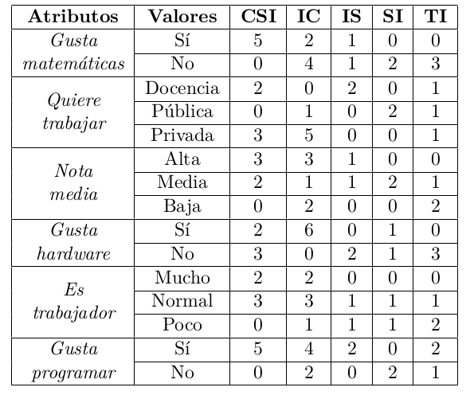
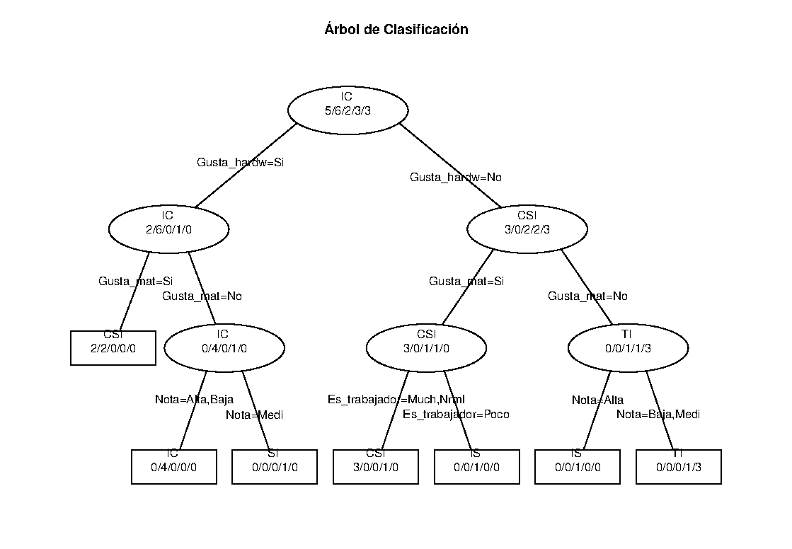

# Algoritmo de aprendizaje para árbol de clasificación

## Miguel Lentisco Ballesteros

Aconsejamos las ramas a cada alumno reflejada en la siguiente tabla:

| Caso | Gusta Mates | Quiere trabajar | Nota media | Gusta hardware | Como Trabaja | Gusta programar | Rama(s) aconsejadas
| --- | --- | --- | --- | --- | --- | --- | --- |
Alumno 1 | Si | Docencia | Alta | No | Mucho | Si | CSI
Alumno 2 | No | Empresa Pública | Media | No | Normal | No | SI
Alumno 3 | Si | Empresa Privada | Media | Si | Normal | Si | CSI, IC
Alumno 4 | No | Empresa Privada | Baja | No | Poco | Si | TI
Alumno 5 | No | Empresa Privada | Alta | Si | Mucho | Si | IC
Alumno 6 | Si | Docencia | Media | No | Poco | Si | IS
Alumno 7 | No | Docencia | Alta | No | Normal | Si | IS
Alumno 8 | No | Empresa Pública | Baja | Si | Normal | No | IC
Alumno 9 | Si | Empresa Privada | Alta | No | Normal | Si | CSI
Alumno 10 | No | Empresa Pública | Baja | No | Poco | Si | TI
Alumno 11 | Si | Empresa Privada | Alta | Si | Normal | No | CSI, IC
Alumno 12 | No | Empresa Privada | Baja | Si | Poco | Si | IC
Alumno 13 | No | Empresa Privada | Alta | Si | Normal | Si | IC
Alumno 14 | Si | Docencia | Media | No | Mucho | Si | CSI
Alumno 15 | No | Docencia | Media | No | Normal | No | TI
Alumno 16 | No | Empresa Pública | Media | Si | Poco | No | SI

Consideramos con varias recomendaciones al mismo alumno como ejemplos separados, y agrupamos según la frecuencia de cada atributo en cada rama:

Ahora usamos un algorítmo de aprendizaje basado en entropía (ID3) de manera que obtenemos el siguiente árbol de decisión:

Finalmente obtenemos las reglas:

  - IF (Gusta_hardw=Si AND Gusta_mat=SI) OR (Gusta_hardw=No AND Gusta_mat=Si AND (Es_trabajador=Much OR Es_trabajador=Nrml)) THEN **CSI**

  - IF Gusta_hardw=Si AND Gusta_mat=No AND (Nota=Alta OR Nota=Baja) THEN **IC**

  - IF Gusta_hardw=No AND ((Gusta_mat=Si AND Es_trabajador=Poco) OR (Gusta_mat=No AND Nota=Alta)) THEN **IS**

  - IF Gusta_hardw=Si AND Gusta_mat=No AND Nota=Medi THEN **SI**

  - IF Gusta_hardw=No AND Gusta_mat=No AND (Nota=Baja OR Nota=Medi) THEN **TI**

Que son válidas.
