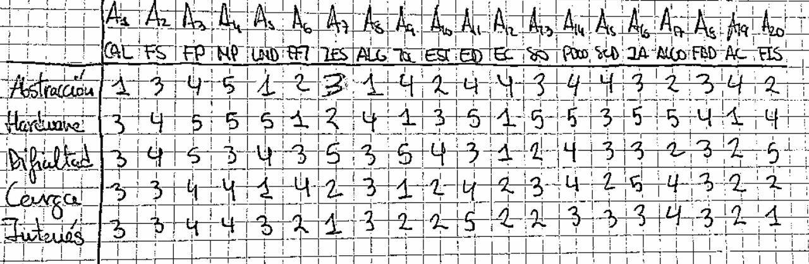
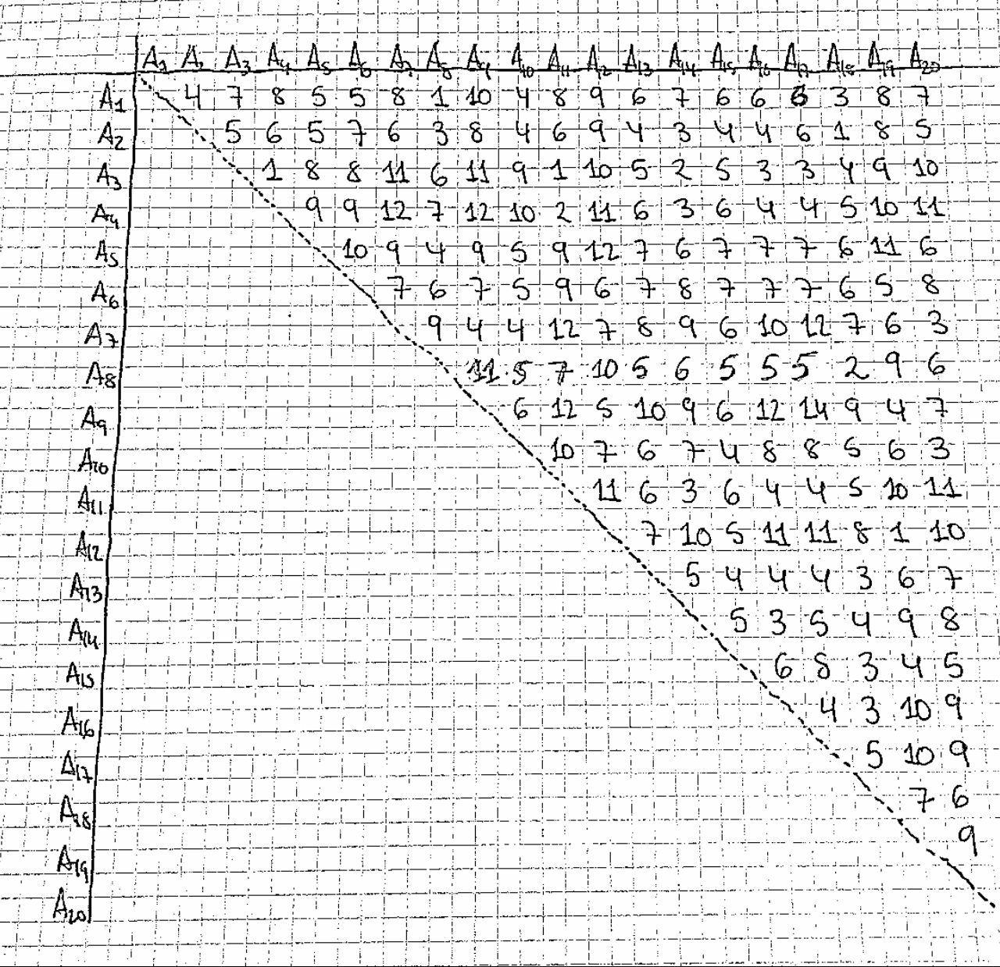
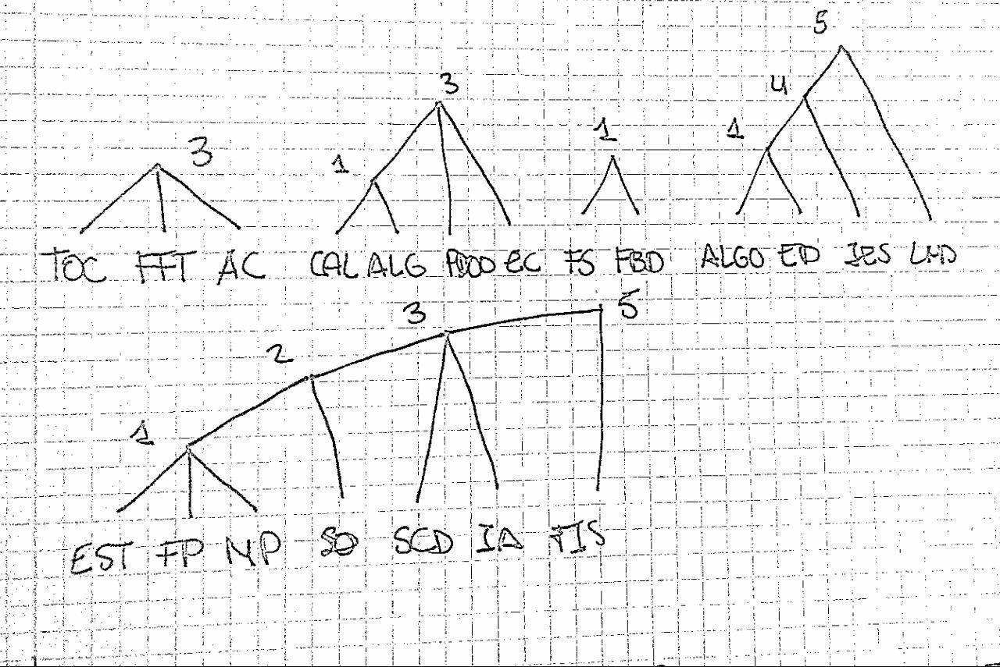

# Ejercicio de rejilla

## Miguel Lentisco Ballesteros

Aqui está la tabla con las asignaturas y sus valores para cada métrica:

Ahora obtenemos la matriz de distancias:

Donde después de 14 iteraciones obtenemos los siguientes grupos:

